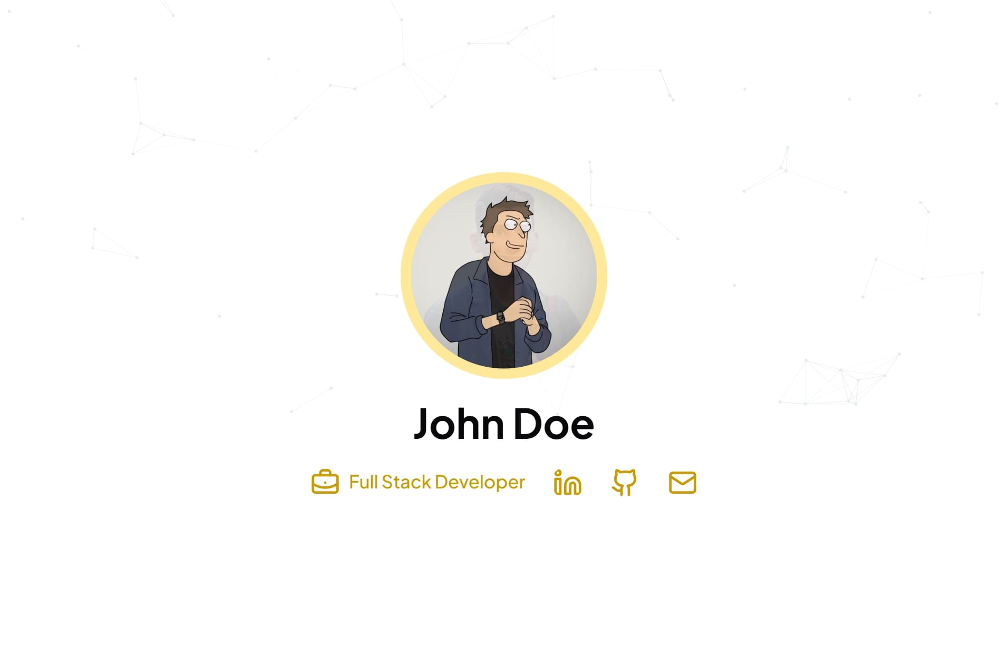

 
   

# Iamgdev v2

Selamat datang di repository **iamgdevvv** site-v2 Website Template 🎉

Template website yang dibangun oleh **pribadi** dengan semangat bingung mau ngapain weekend.\
Kalian juga dapat menggunakan website template ini secara gratis.

## 📖 Lisensi

Seluruh template di repository ini dirilis di bawah **Apache License 2.0 dengan Atribusi Wajib**.\
Artinya:

- Anda bebas menggunakan, memodifikasi, dan mendistribusikan
  template ini.
- **Wajib mencantumkan atribusi** kepada Grafis Nuresa dalam bentuk:
    - Nama proyek dibuat dengan X **Iamgdev**
    - Tautan menuju repository atau website Iamgdev
    - Atribusi tidak boleh dihapus dalam kondisi apapun.

📌 Detail lengkap mengenai lisensi dapat dibaca di file
[LICENSE.md](./LICENSE.md) dan [NOTICE.md](./NOTICE.md).

## 🙌 Kontribusi

Kami selalu terbuka bagi siapa pun yang ingin menjadi bagian dari tempate website gratis ini.\
Silakan cek panduan kontribusi di [CONTRIBUTING.md](./CONTRIBUTING.md).

## ❤️ Apresiasi

Jika Anda menggunakan template ini, jangan lupa memberikan atribusi sebagai bentuk apresiasi.\
Hal ini sangat berarti bagi saya pribadi, karena membantu membangun portofolio saya.

---

Dibangun dengan cinta oleh [Grafis Nuresa](https://iamgdev.my.id)
