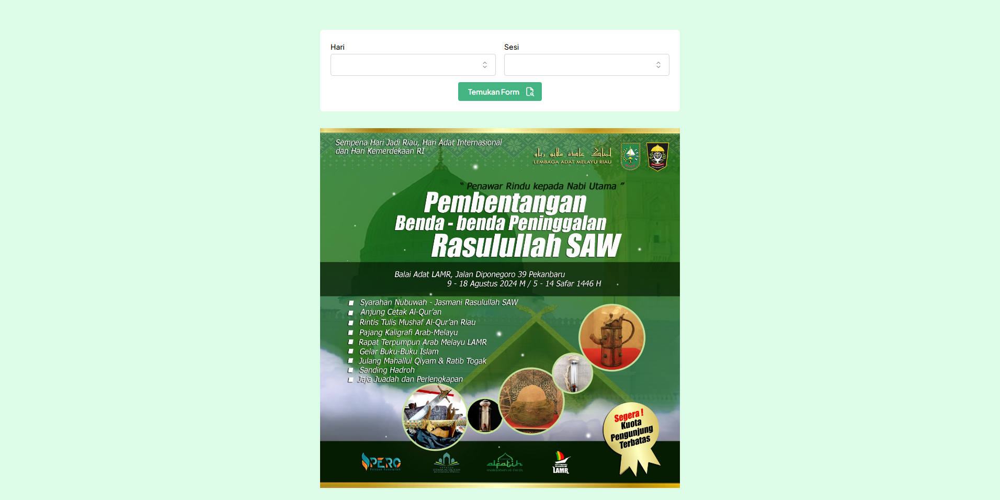
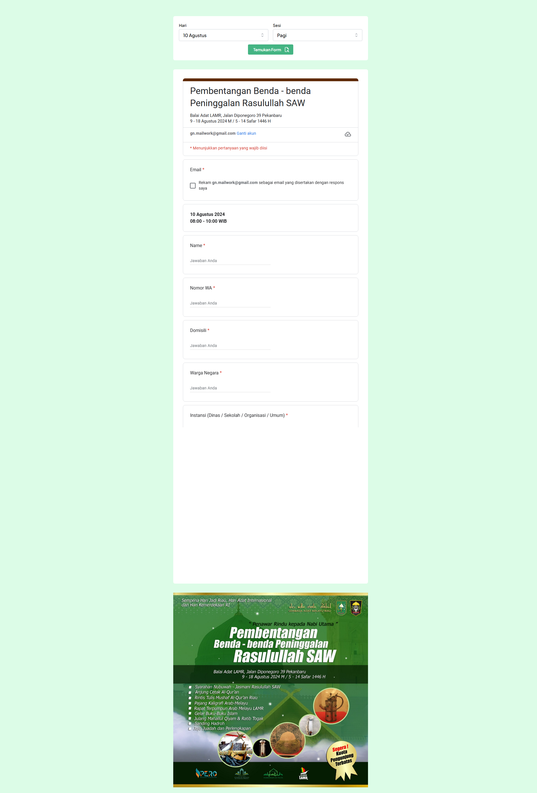

## Description

This website using for information and registration for the event showcasing the Relics of the Prophet Muhammad (SAW) in Riau. This event is held by Lembaga Adat Melayu Riau. The biggest challenge is the lack of budget, this website must collect registered users in one document, so I decided to use Google forms to answer the challenge.

## Stacks

- [Next.js](https://nextjs.org)
- [Mantine](https://mantine.dev)
- [Tailwind CSS](https://tailwindcss.com)
- [Typescript](https://www.typescriptlang.org)

## Preview

