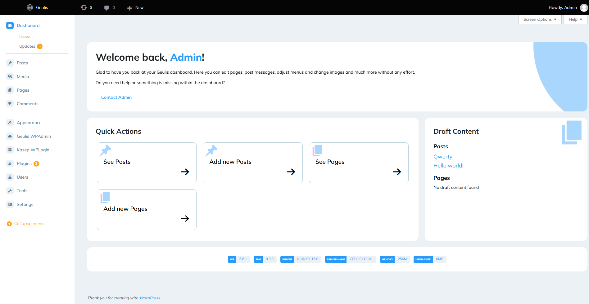
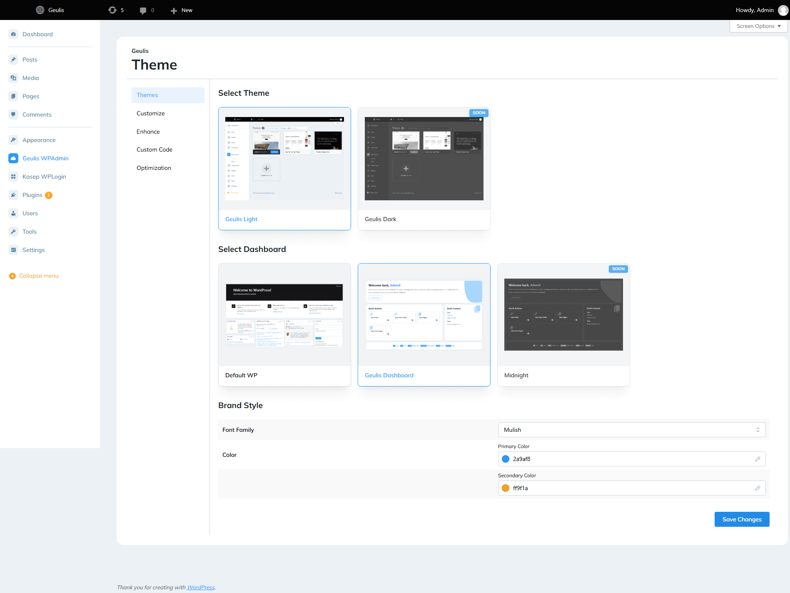
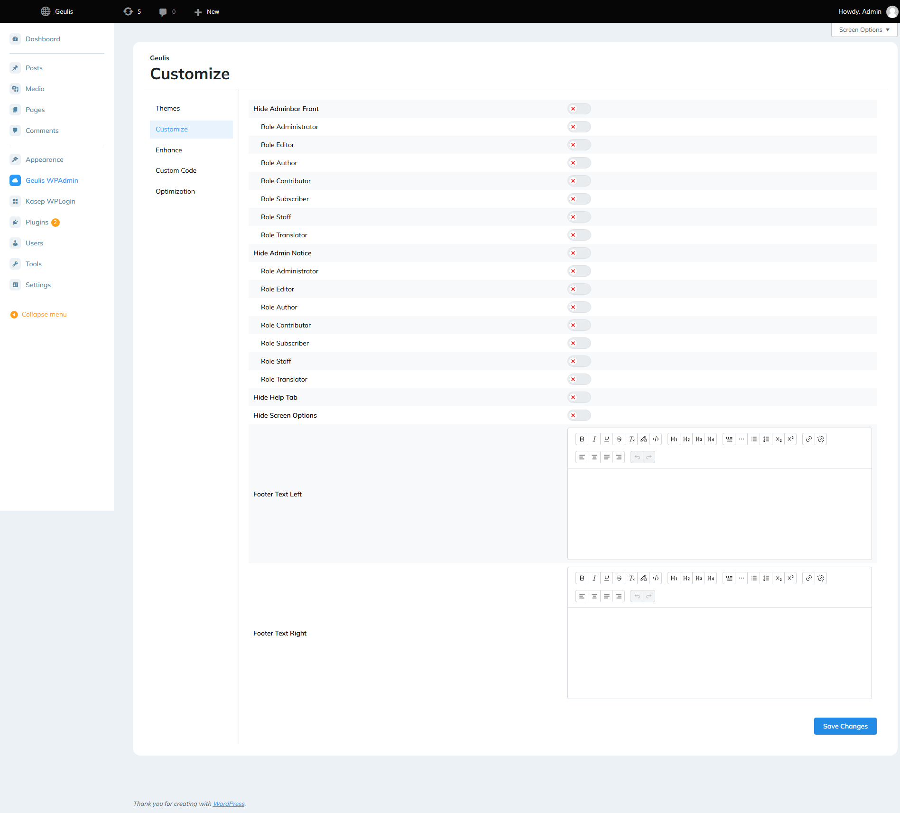
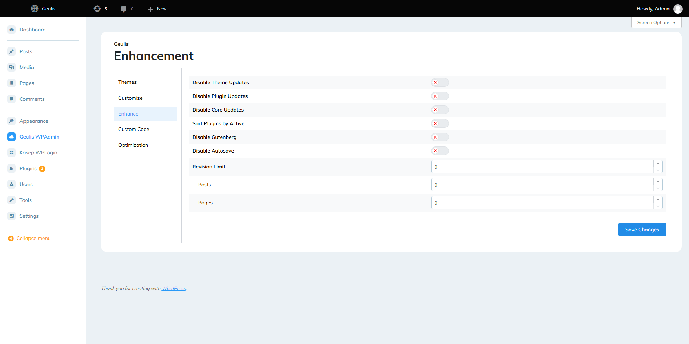
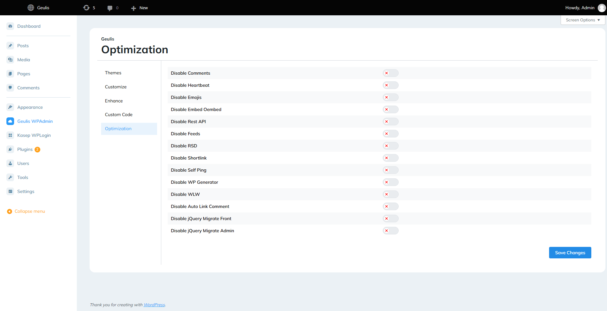
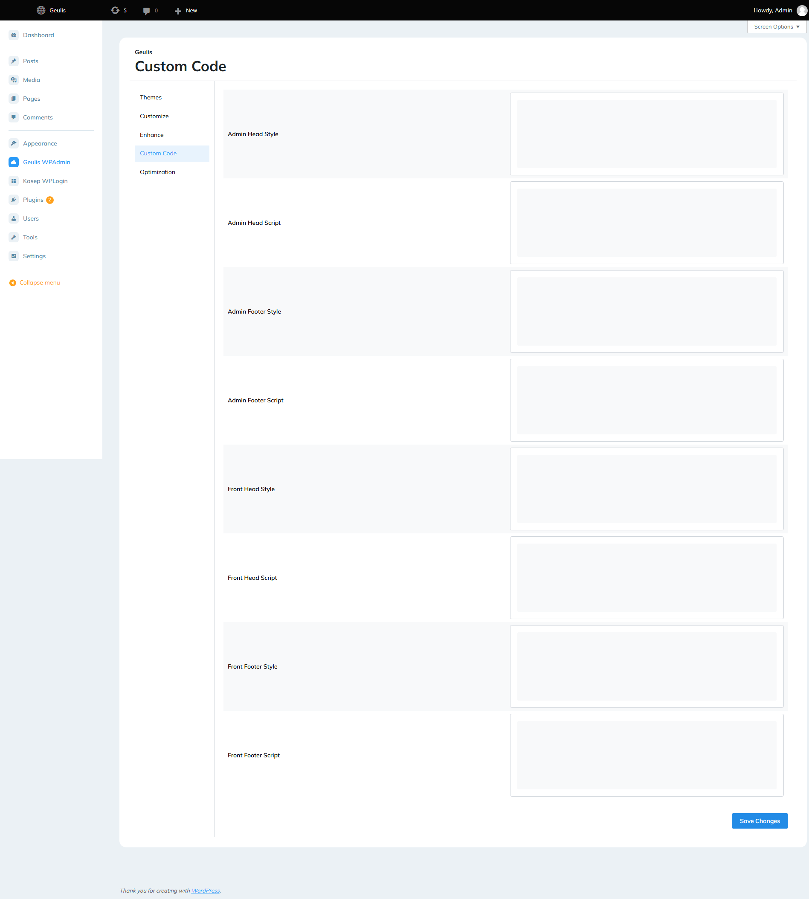

## Description

Geulis WPAdmin is a robust solution designed to streamline and enhance your WordPress admin experience. Engineered with advanced customization and optimization capabilities, this plugin offers unparalleled control over your dashboard’s appearance and functionality.

## Stacks

- [Wordpress](https://wordpress.org)
- [Vite](https://vitejs.dev)
- [React](https://react.dev)
- [Mantine](https://mantine.dev)
- [Tailwind CSS](https://tailwindcss.com)
- [Typescript](https://www.typescriptlang.org)

## Preview

