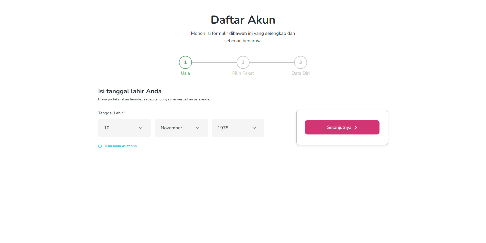
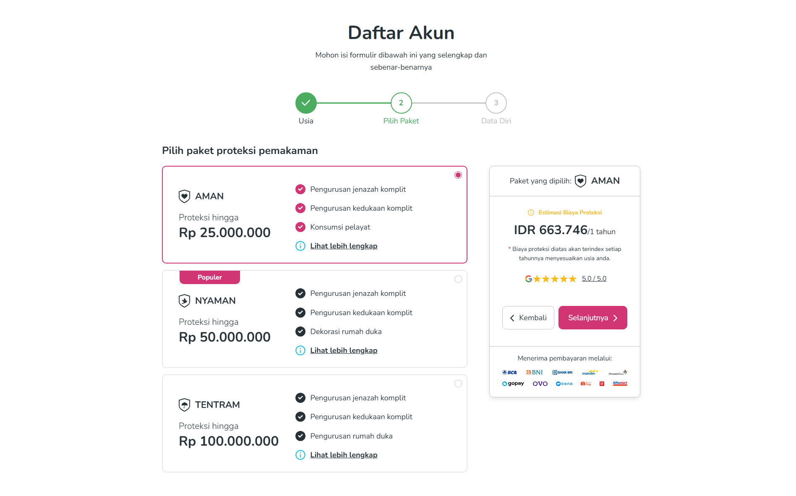
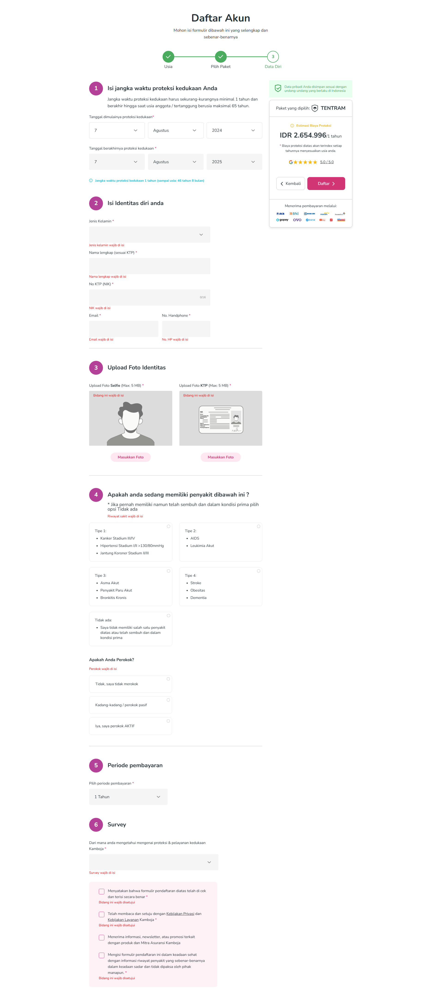

## Description

Kamboja website provides users with a seamless and informative platform to plan and secure their end-of-life arrangements. The site offers a comprehensive solution for users to prepare for the future, ensuring that their loved ones are protected from unexpected burdens after their departure.

## Stacks
- [Vite](https://vitejs.dev)
- [Vue](https://vuejs.org)
- [Vuex](https://vuex.vuejs.org)
- [WindiCSS](https://windicss.org)
- ~~Typescript~~

## Preview

