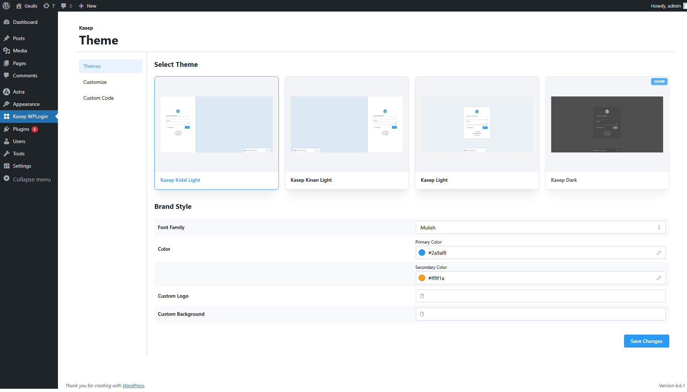
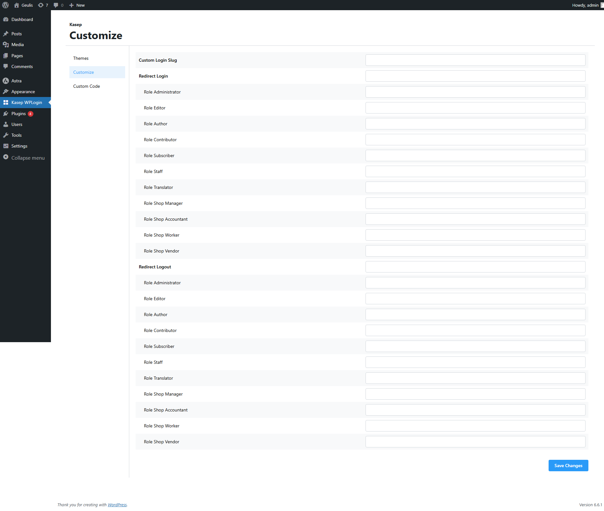
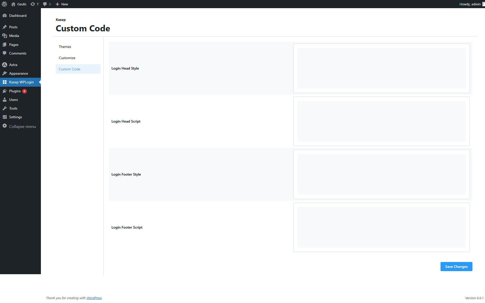
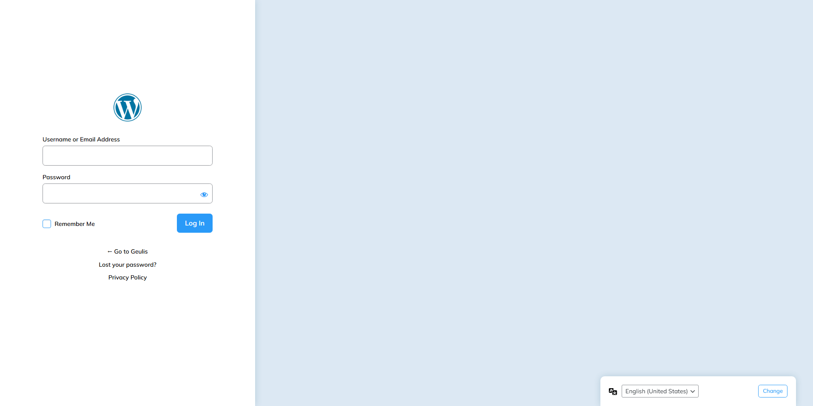
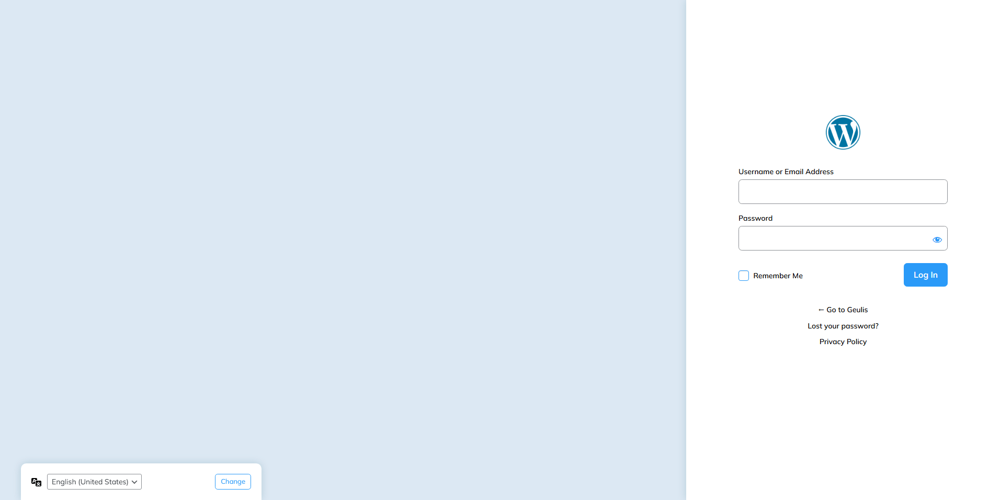

## Description

Kasep WPLogin is a robust solution designed to streamline and enhance your WordPress login experience. Engineered with advanced customization and optimization capabilities, this plugin offers unparalleled control over your login appearance and functionality.

| Platform   | Link                                                                                         
|------------|----------------------------------------------------------------------------------------------|
| Codester   | https://www.codester.com/items/50856/kasep-wplogin-wordpress-login |
| CodeGrape  | https://www.codegrape.com/item/kasep-wplogin-responsive-prettiest-wp-login/57223 |

## Stacks

- [Wordpress](https://wordpress.org)
- [Vite](https://vitejs.dev)
- [React](https://react.dev)
- [Mantine](https://mantine.dev)
- [Tailwind CSS](https://tailwindcss.com)
- [Typescript](https://www.typescriptlang.org)

## Preview

