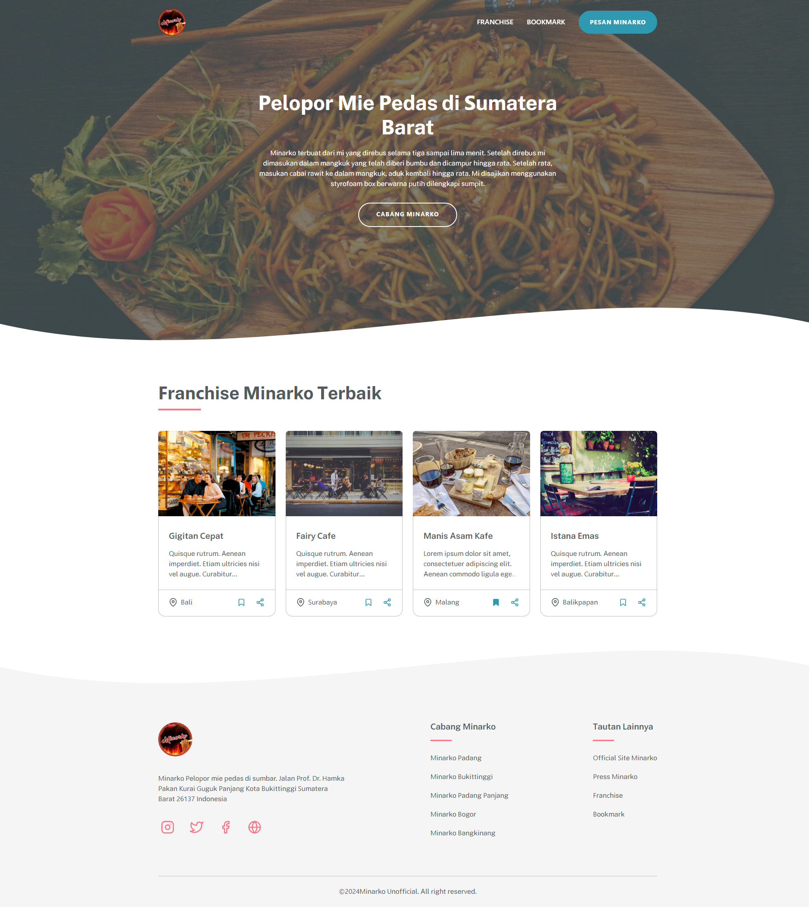
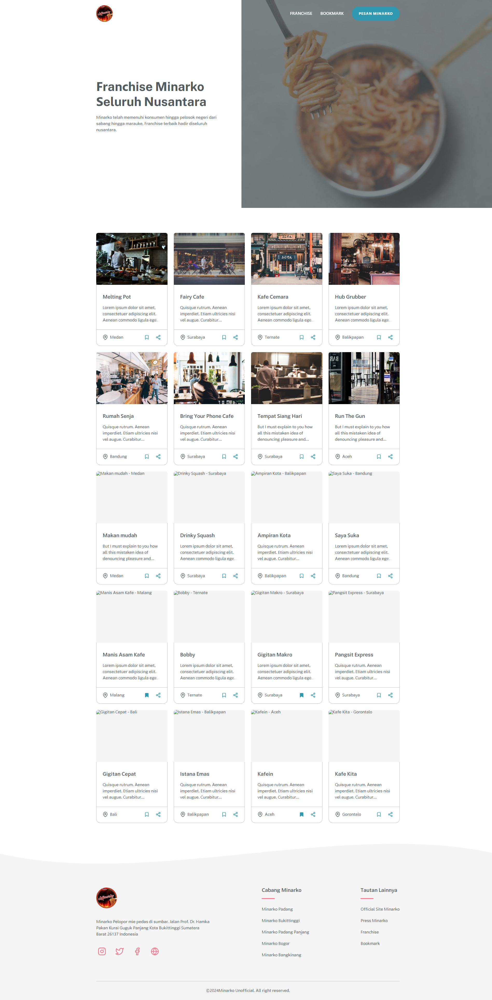
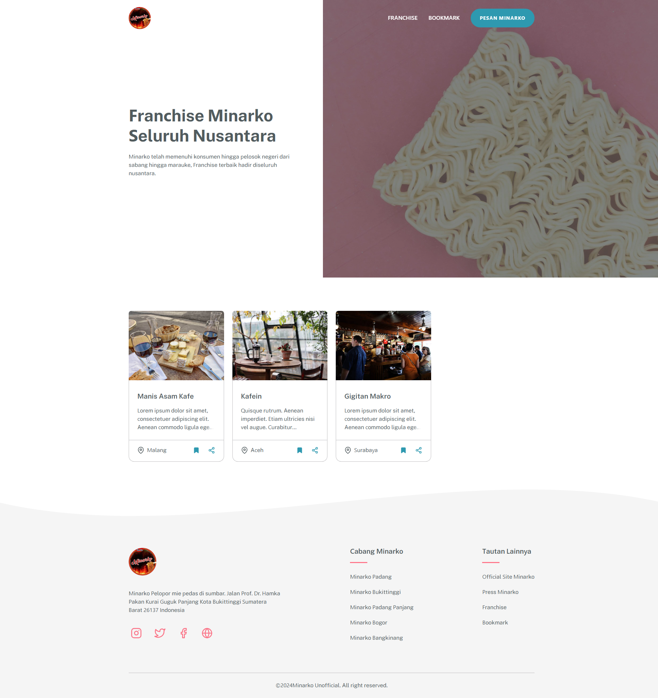
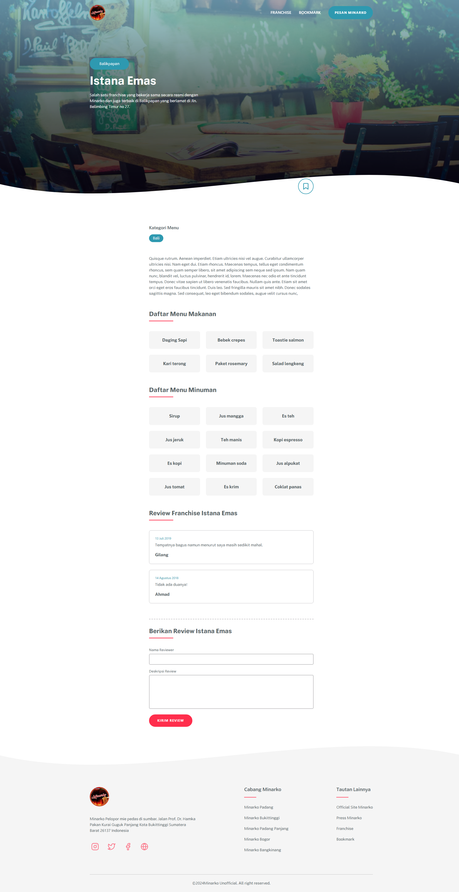

## Description

Mieapinarko is a mock website dedicated to listing restaurant franchises. It features a range of fictional franchise opportunities, showcasing various restaurant concepts and business models. While the site provides detailed information and listings about these imaginary franchises, it's important to note that the content is purely fictional and intended for demonstration purposes only. Users can explore different restaurant ideas, view sample franchise details, and engage with the site's content as a creative example of franchise listings. All those data came from this api [https://restaurant-api.dicoding.dev](https://restaurant-api.dicoding.dev)

## Stacks

- [Webpack](https://webpack.js.org)
- [Puppeteer](https://pptr.dev)
- [Karma](https://karma-runner.github.io)
- ~~Typescript~~

## Preview

