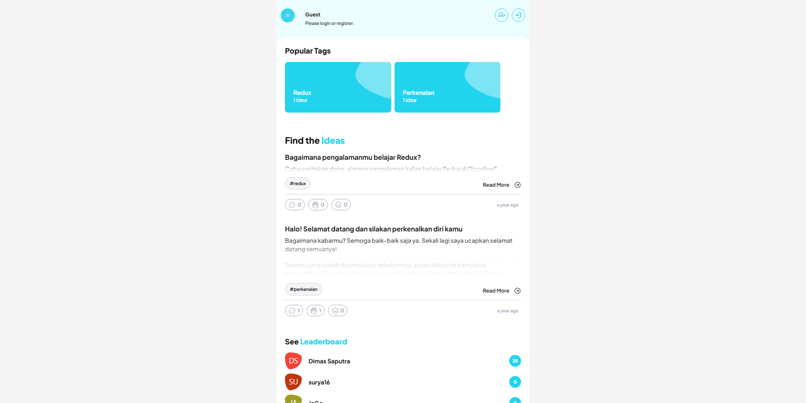
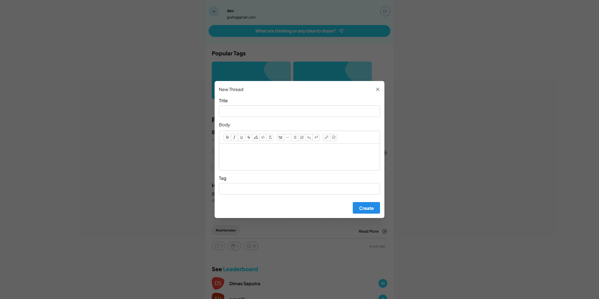
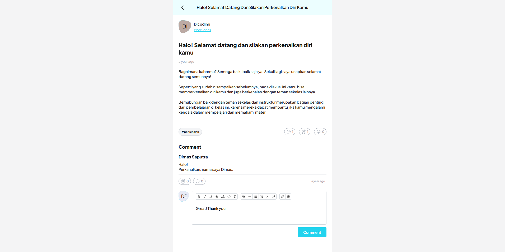

## Description

Ngydey is a dynamic platform designed for idea exchange and community engagement. Users can share their ideas, provide feedback, and express appreciation for concepts submitted by others. The site fosters a collaborative environment where individuals can discuss and refine ideas through comments and interactions. With its user-friendly interface, Ngydey encourages meaningful exchanges and supports the growth of innovative thoughts and solutions within its community.

## Stacks

- [Vite](https://vitejs.dev)
- [React](https://react.dev)
- [Redux](https://redux.js.org)
- [React Router](https://reactrouter.com)
- [Mantine](https://mantine.dev)
- [Redux](https://redux.js.org)
- [Tailwind CSS](https://tailwindcss.com)
- [Typescript](https://www.typescriptlang.org)
- [Cypress](https://www.cypress.io)
- [Vitest](https://vitest.dev)
- [Storybook](https://storybook.js.org)

## Preview

