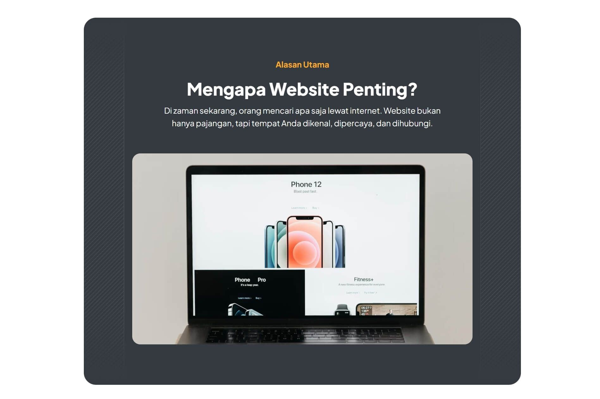
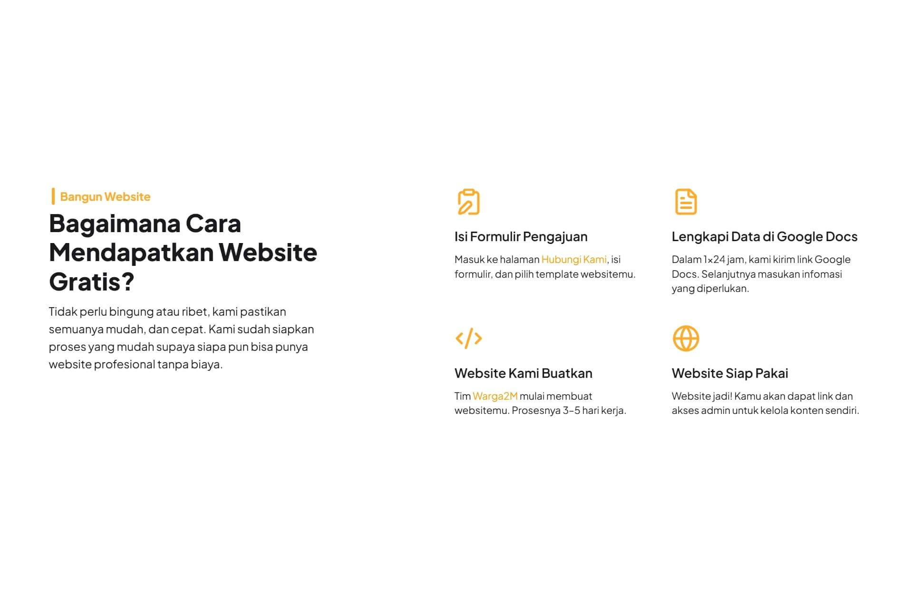
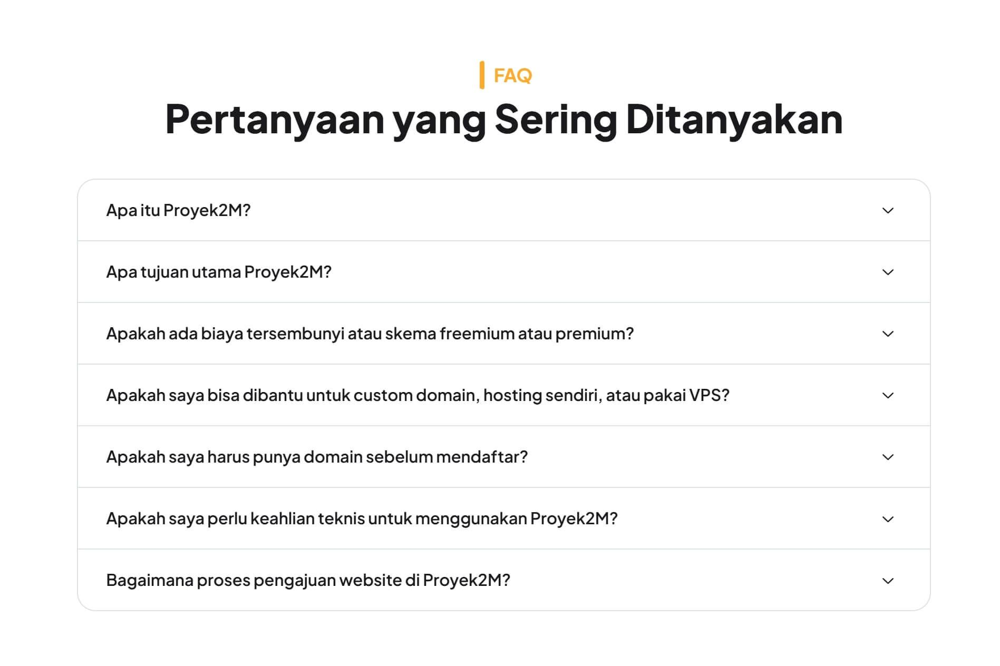
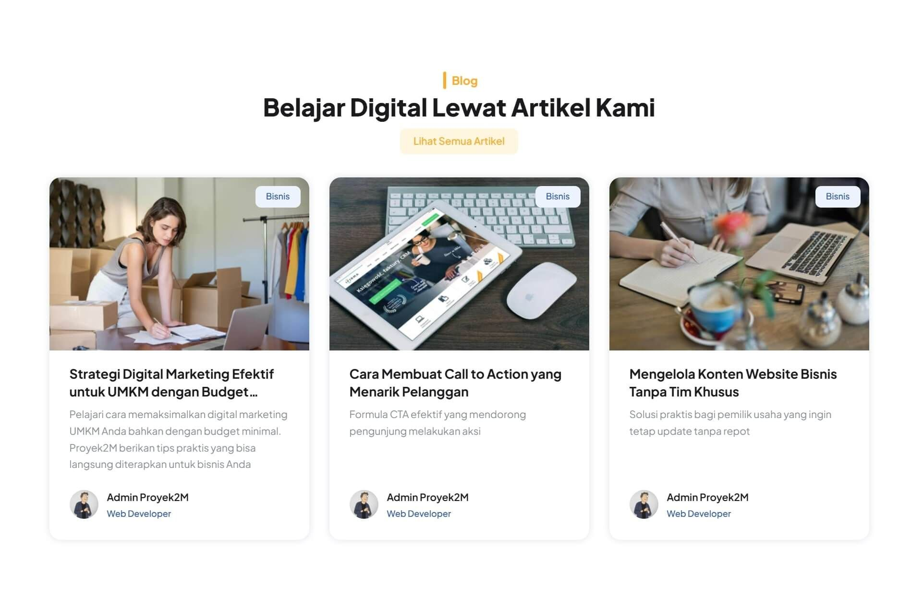
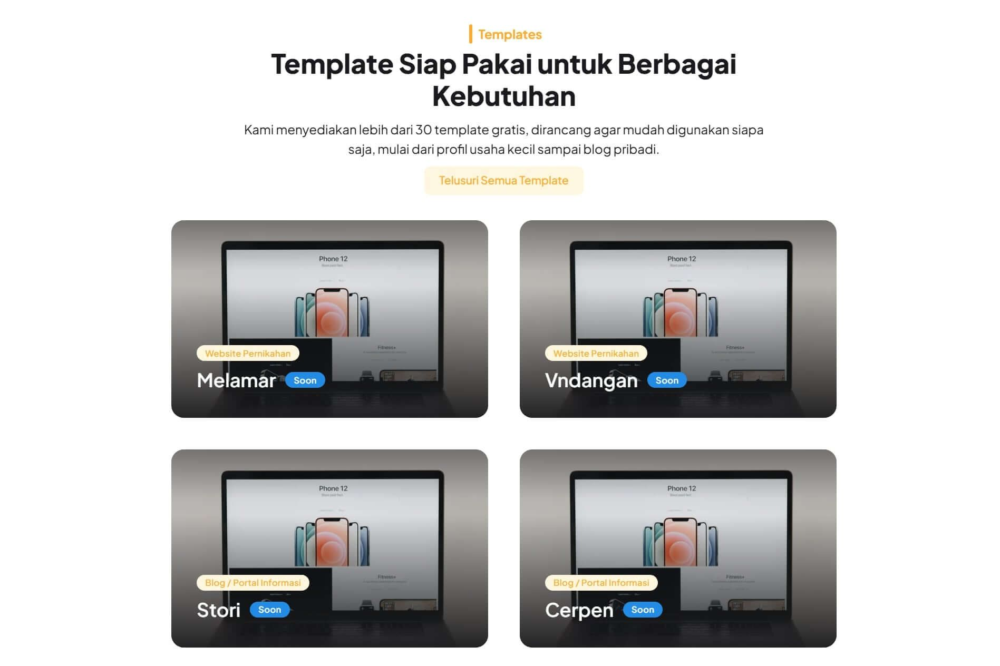

## Description

Proyek2M was born out of our concern over the increasingly unhealthy state of the website development industry. Many market players are competing to slash prices, thereby devaluing creative and technical work. This not only affects the quality of the final product for clients but also the well-being of digital workers—from inadequate wages, lack of incentives such as insurance, to the risk of mass layoffs without any guarantees.

Additionally, we observe that it is becoming increasingly difficult for new talent—both those with no experience and fresh graduates—to gain real learning opportunities. Many companies are reluctant to open positions for juniors due to pressure from efficiency, automation, and the widespread use of AI.

Proyek2M was initiated as an alternative space:

- Creating collaborative work experiences in projects that are actually used in production, not just simulation exercises.
- Providing concrete portfolios and credibility points for Warga2M members, so they are better prepared to compete in the professional job market.
- While also helping individuals, SMEs, communities, and organizations that want to have a quality website for free.

We believe that a healthy digital future is built through collaboration, transparency, and recognition of every contribution—big or small.

## Stacks

- [Next.js](https://nextjs.org)
- [PayloadCMS](https://payloadcms.com)
- [Mantine](https://mantine.dev)
- [Tailwind CSS](https://tailwindcss.com)
- [Typescript](https://www.typescriptlang.org)

## Preview

