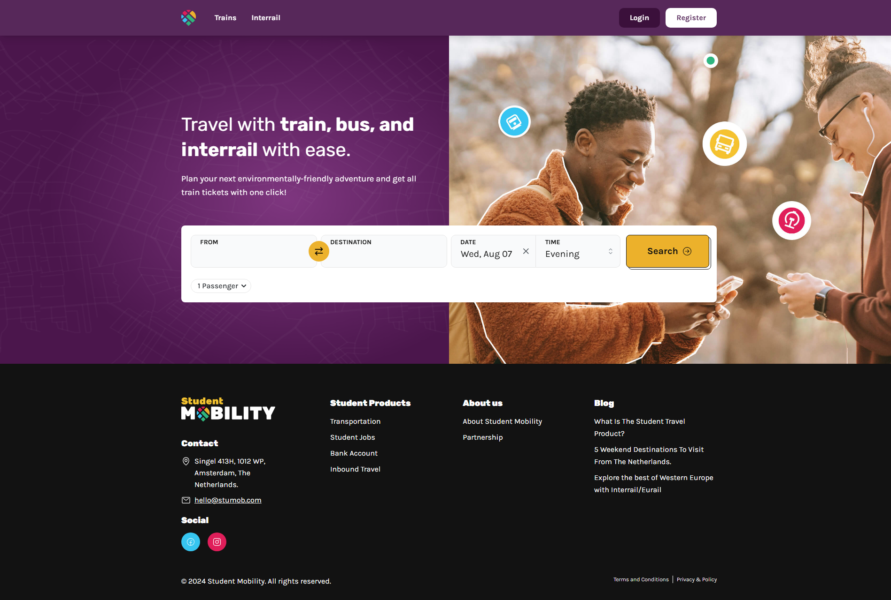
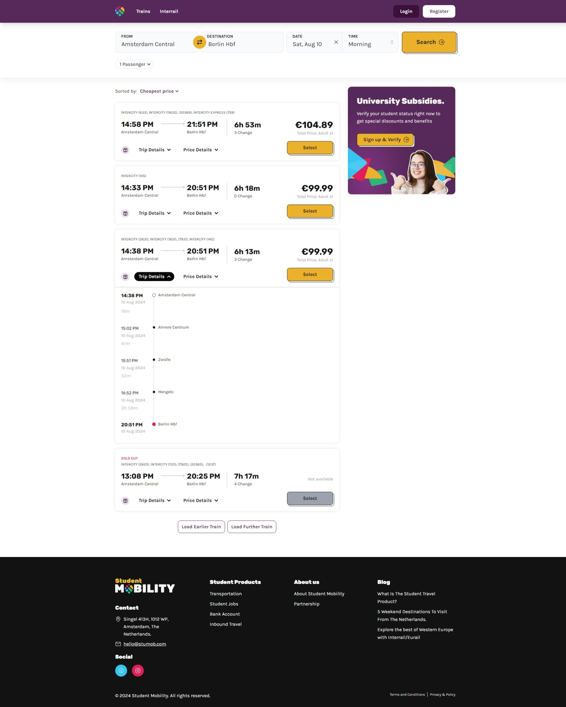
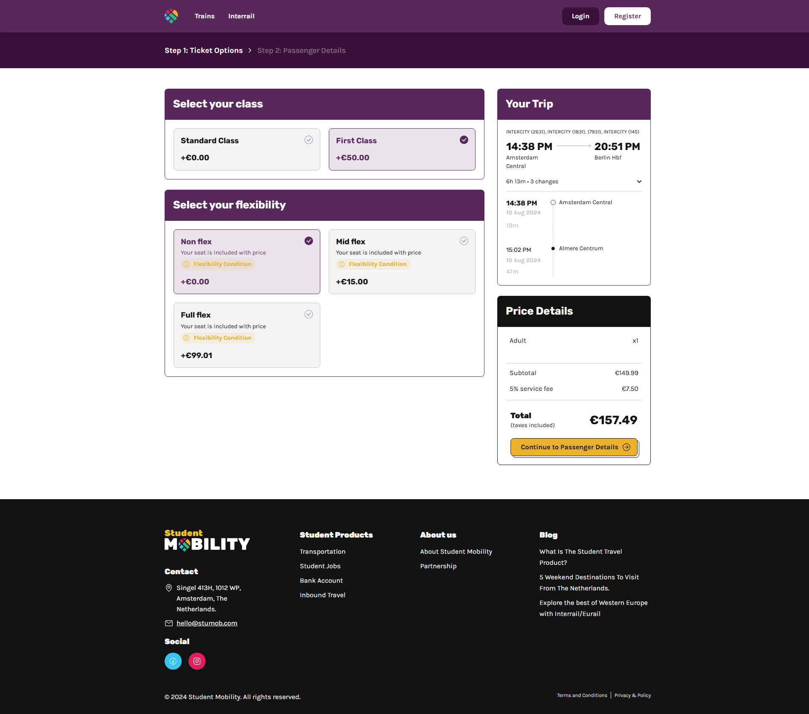
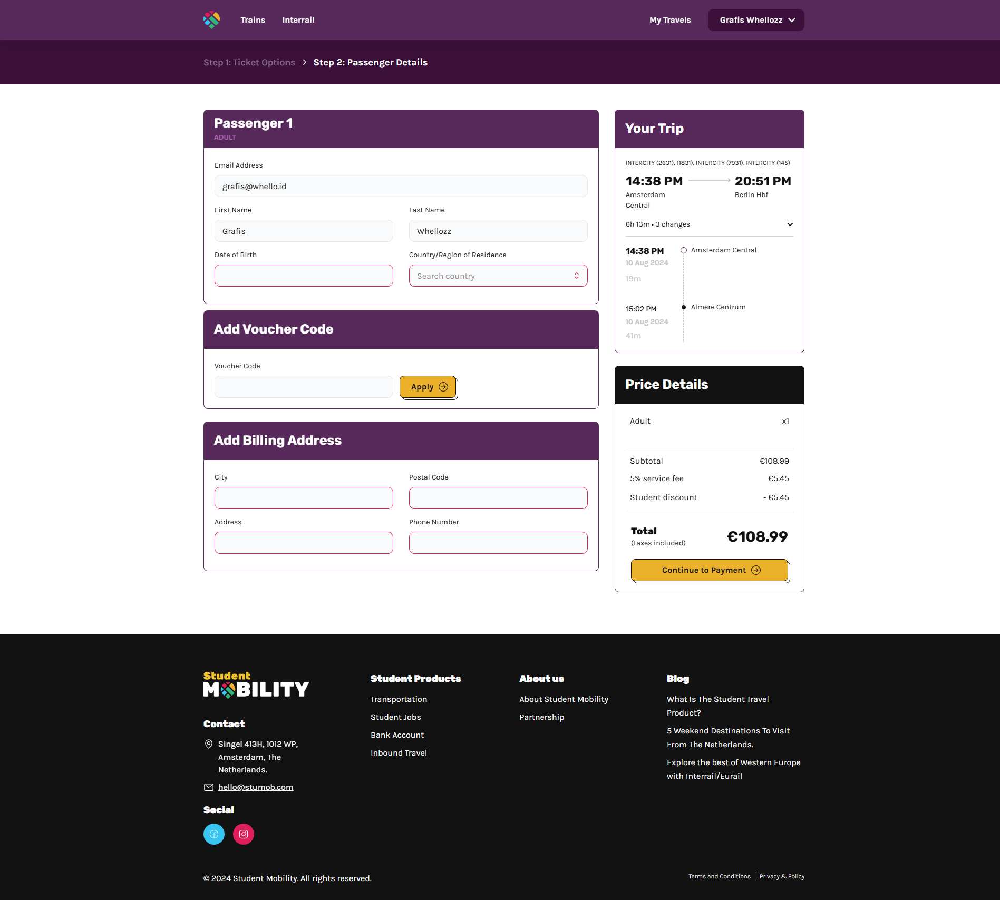
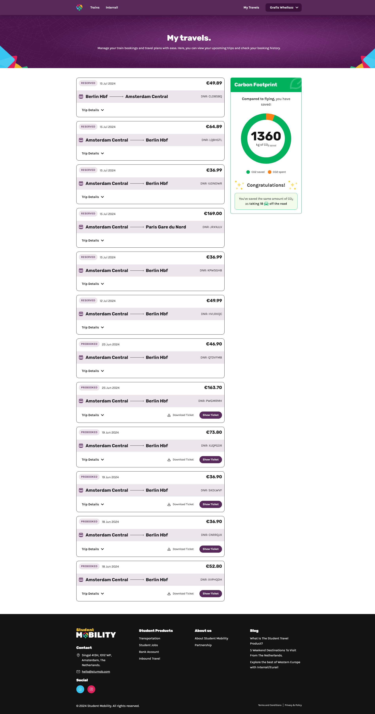
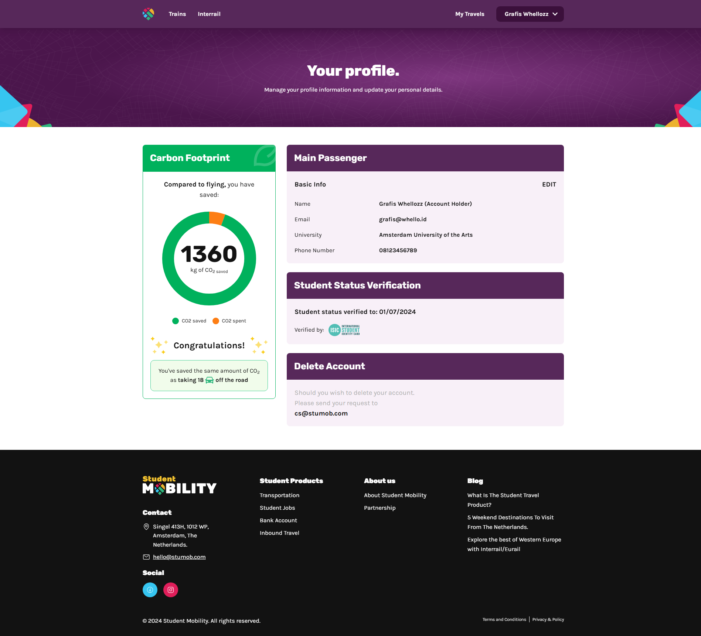

## Description

Booking Student Mobility is a travel-focused website designed to simplify and enhance the experience of traveling by train, bus, and interrail across various destinations. The platform provides users with tools and resources to plan and manage their journeys efficiently, offering a seamless travel experience.

## Stacks

- [Next.js](https://nextjs.org)
- [Mantine](https://mantine.dev)
- [Redux](https://redux.js.org)
- [Tailwind CSS](https://tailwindcss.com)
- [Typescript](https://www.typescriptlang.org)

## Preview

