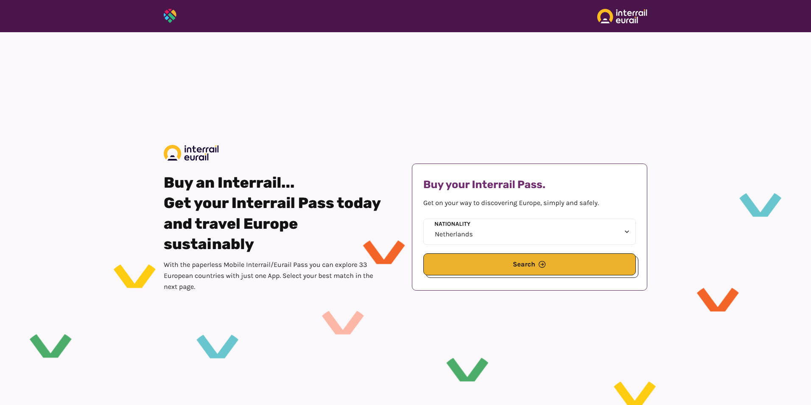
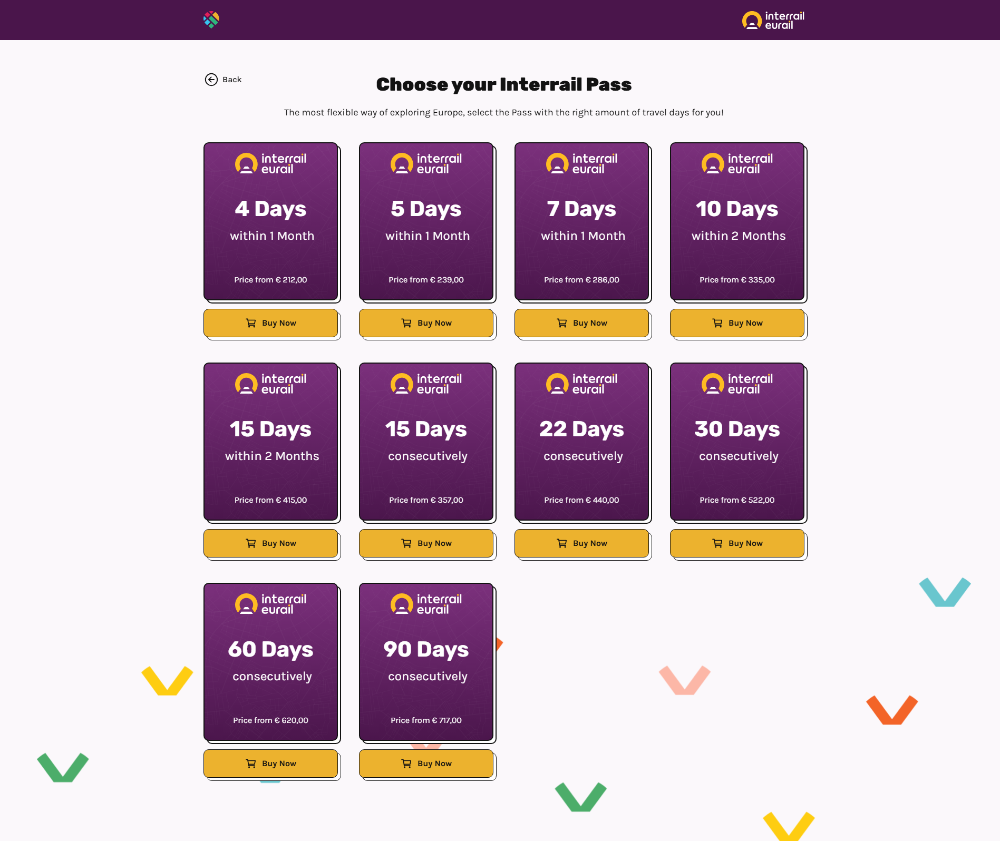
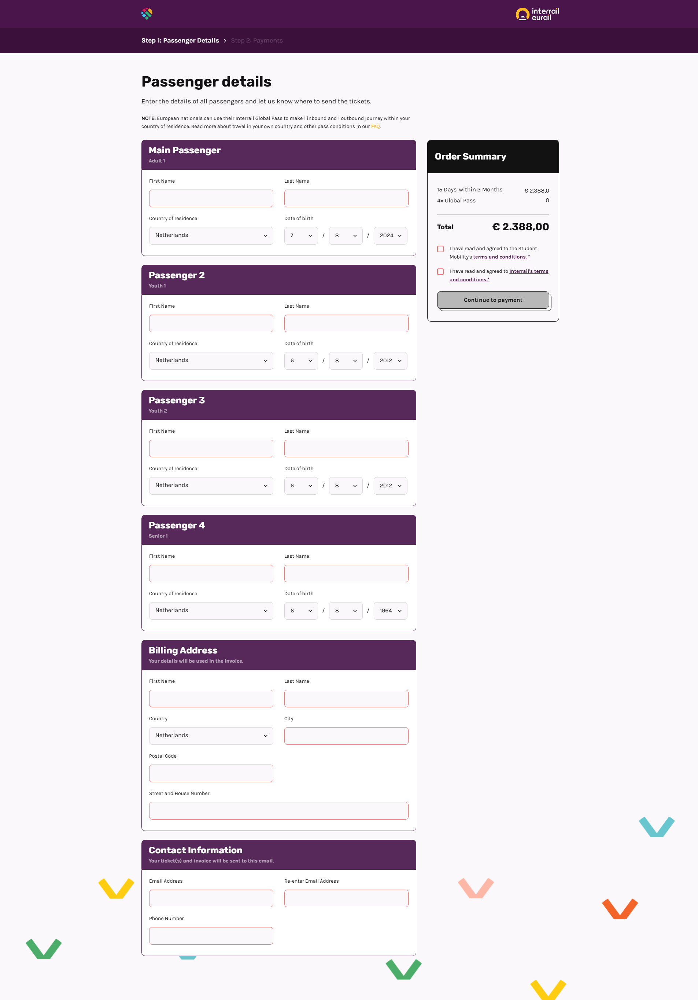
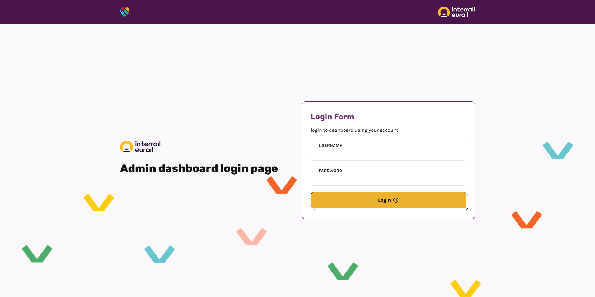
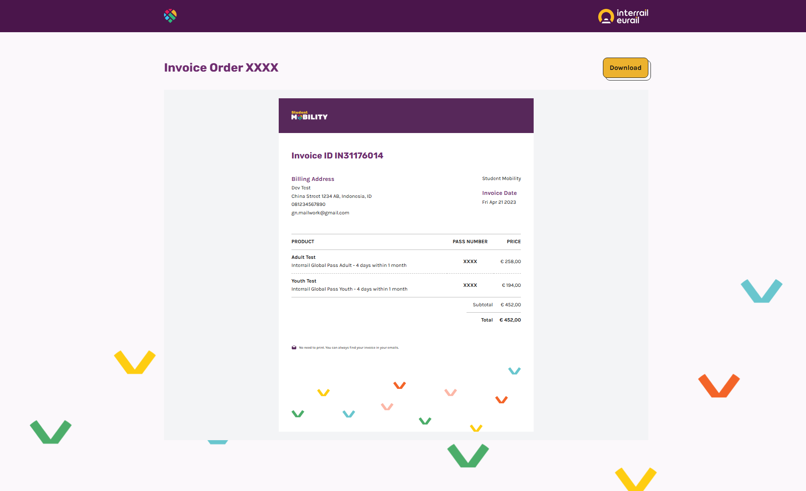

## Description

Interrail Student Mobility website provides information on how to purchase and use an Interrail Pass, which allows unlimited train travel across Europe for a specified period of time. The website also includes details on various types of Interrail Passes, eligibility criteria, and travel tips. Additionally, it offers resources for planning a trip, such as a journey planner and a downloadable map.

## Stacks
- [Next.js](https://nextjs.org)
- [jsPDF](https://www.npmjs.com/package/jspdf)
- [Mollie](https://www.npmjs.com/package/@mollie/api-client)
- [SendGrid](https://www.npmjs.com/package/@sendgrid/mail)
- [WindiCSS](https://windicss.org)
- ~~Typescript~~

## Preview

