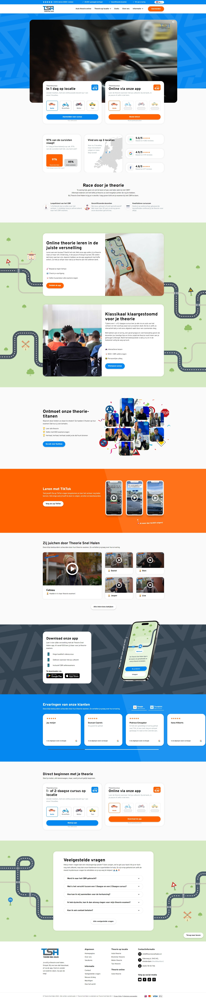
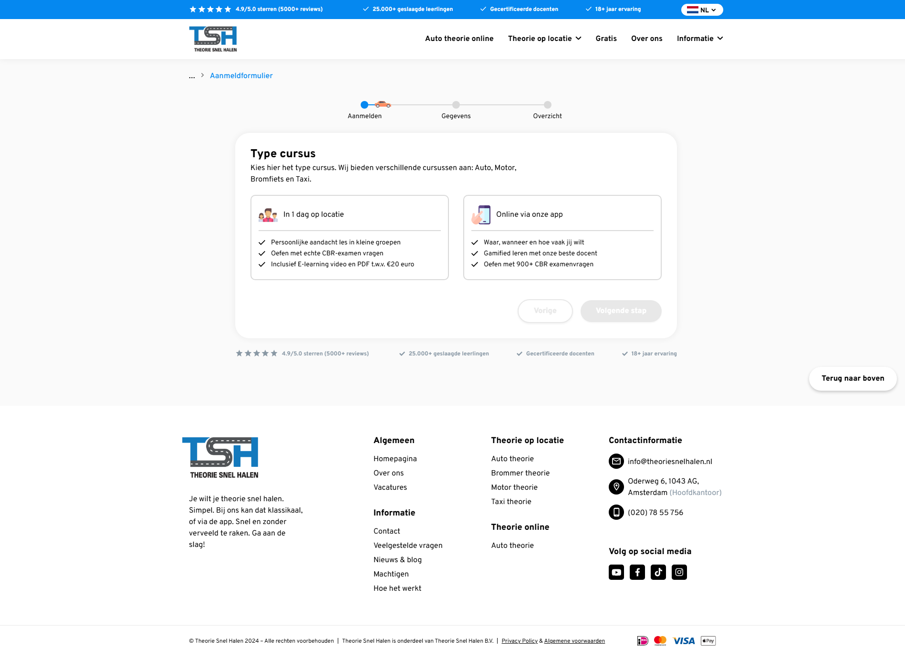
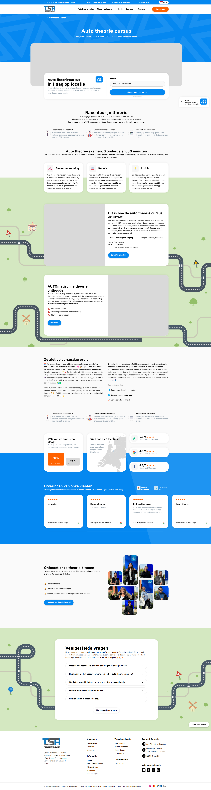
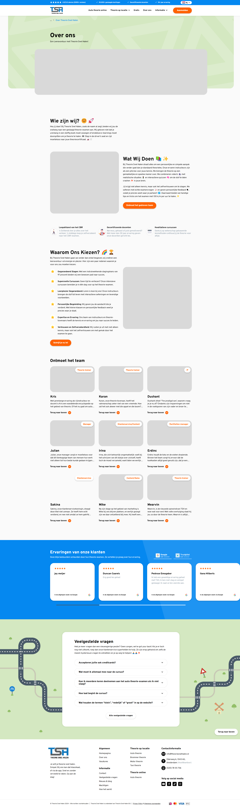
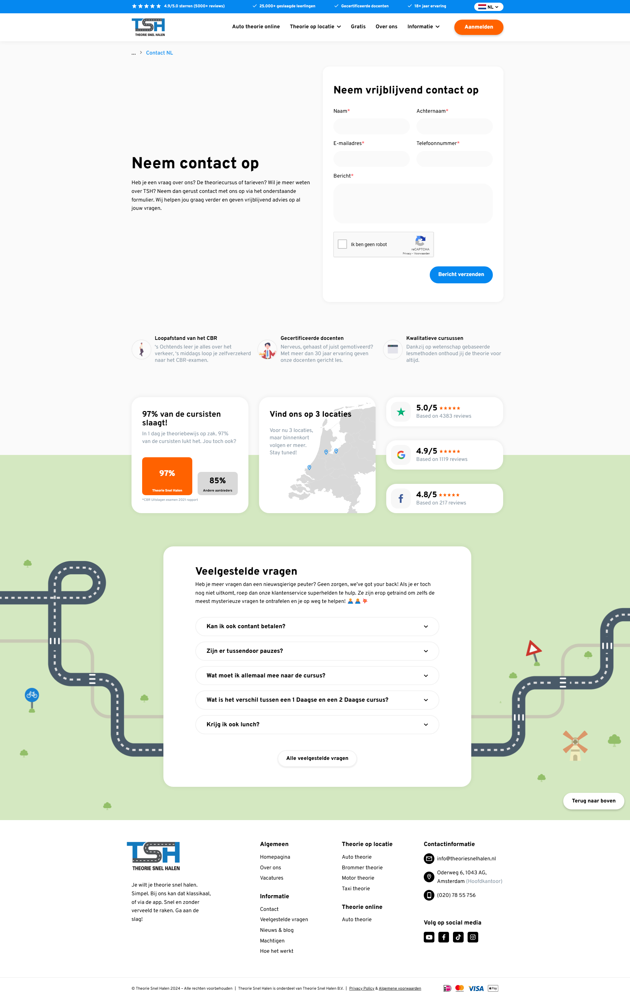
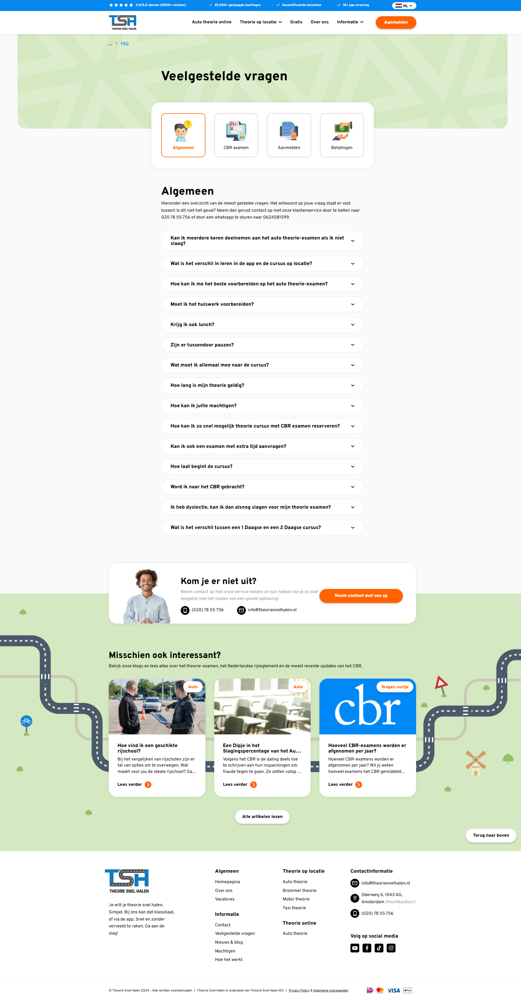
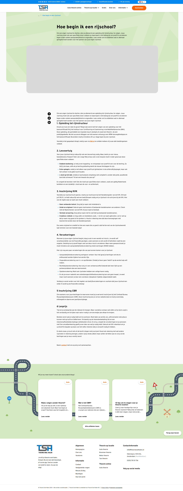

## Description

Theorie Snel Halen, which literally translates to 'Get Your Theory Fast', we offer you the fast track to acing your theory exam. We don't think you should invest hours in laboriously studying a dusty book or slogging through countless e-learning materials to pass your theory test. Step into the driver's seat and smoothly journey towards your theory certificate.

## Stacks

- [Wordpress](https://wordpress.org)
- [Advanced Custom Fields](https://www.advancedcustomfields.com)
- [WPBakery Page Builder](https://wpbakery.com)
- [Polylang](https://polylang.pro)
- [Vite](https://vitejs.dev)
- [React](https://react.dev)
- [Redux](https://redux.js.org)
- [Tailwind CSS](https://tailwindcss.com)
- ~~Typescript~~

## Preview

